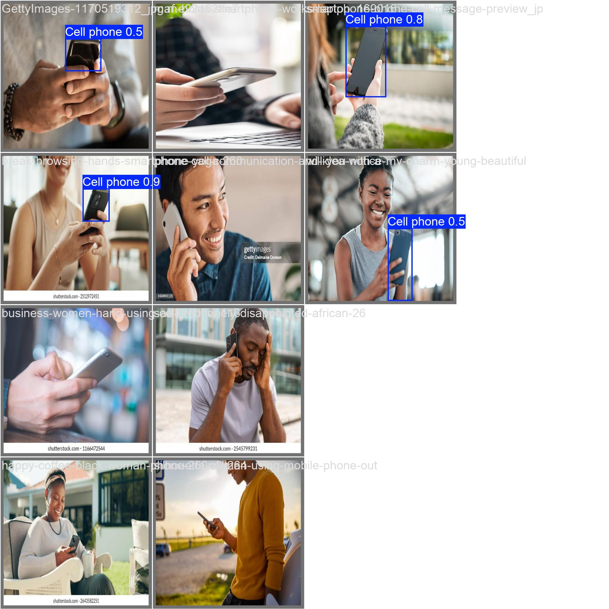
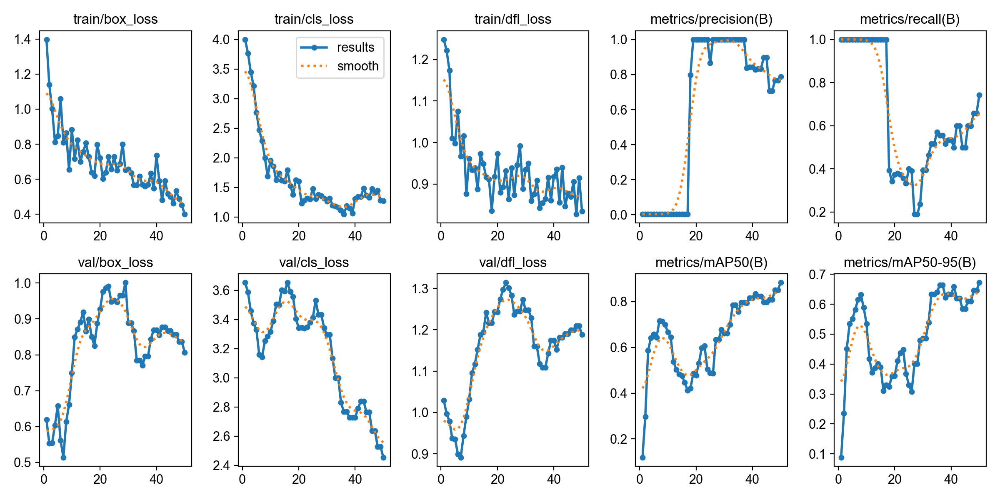
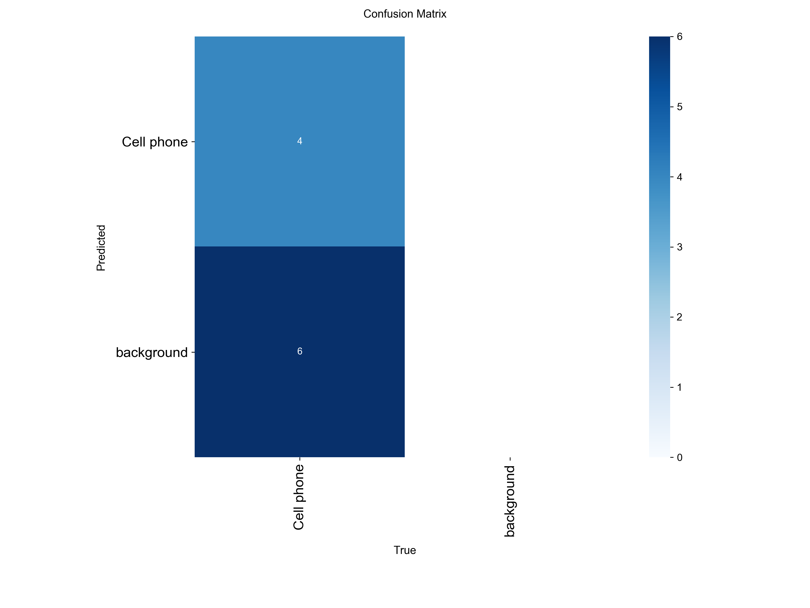

# 📱 Cell Phone Detection using YOLO

## 🔍 Overview
This project detects mobile phones in real-time using a custom-trained YOLO model.

## 🚀 Features
- Real-time object detection using webcam
- Custom dataset training
- Accurate detection using YOLO

## 🛠️ Tech Stack
- Python
- YOLO (Ultralytics)
- OpenCV

## 📊 Dataset
Custom dataset collected and annotated manually using Roboflow.

## ▶️ How to Run

1. Clone the repository:
git clone https://github.com/your-username/Cell-Phone-Detection.git

2. Install dependencies:
pip install -r requirements.txt

3. Run the project:
cd src
python detect.py

## 📷 Detection Output

## 📊 Training Results

## 📉 Confusion Matrix

